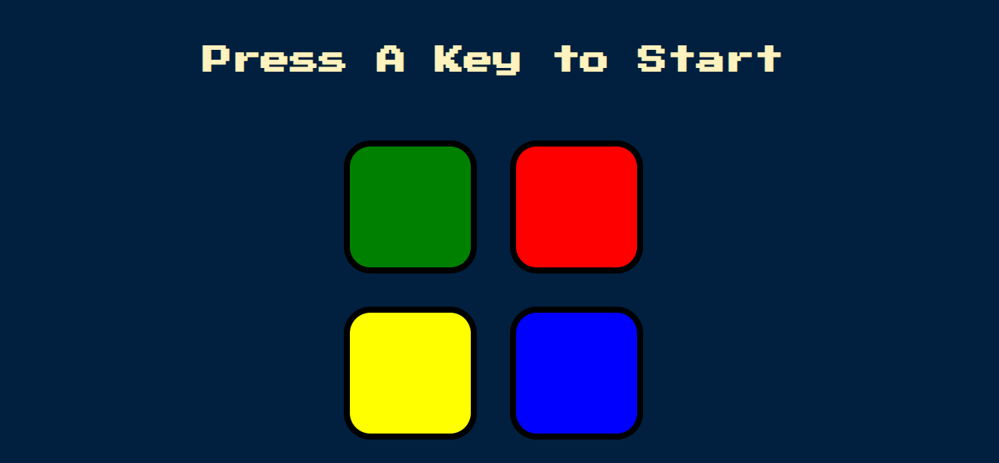
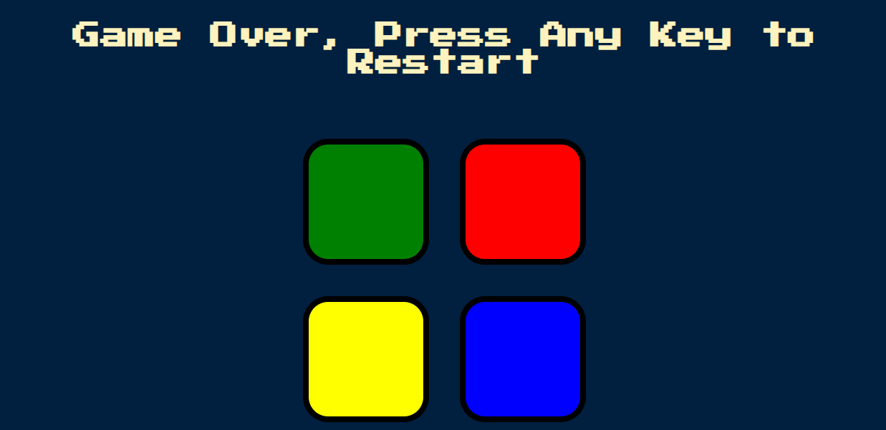

# 🎵 Simon Game

A simple and fun memory-based game built using **HTML, CSS, JavaScript, and jQuery**.  
The player must remember and repeat the sequence of colors shown by the game.  
Each correct round increases the level and adds a new color to the sequence.

---

## 🚀 Features
- Classic **Simon Game logic** (increasing sequence to remember).
- Responsive UI built with **HTML & CSS**.
- Interactive gameplay with **button clicks and sound effects**.
- Smooth animations powered by **jQuery**.

---

## 🛠️ Tech Stack
- **HTML5** – Structure of the game  
- **CSS3** – Styling and layout  
- **JavaScript (ES6)** – Game logic  
- **jQuery** – Event handling and animations  

---

## 🎮 How to Play
1. Press any key to **start the game**.  
2. Watch the sequence of colors shown by the game.  
3. Click the buttons in the **same order**.  
4. Each correct round adds a new color to the sequence.  
5. If you press the wrong button → **Game Over!**  

---

## 📂 Project Structure
index.html # Main HTML file
style.css # Styles for the game
game.js # JavaScript game logic
sounds/ # (Optional) sound files for each button

yaml
Copy code

---

## 💻 Demo
👉 [Live Demo Link](#) *(replace with your deployed link)*  

---

## 📸 Screenshots
  
  

---

## ✨ Future Improvements
- Add **difficulty levels**  
- Show **high score tracking**  
- Add **mobile-friendly design**  

---

## 🤝 Contributing
Feel free to fork this repo and submit pull requests for new features or bug fixes.  

---

## 📜 License
This project is licensed under the **MIT License**.